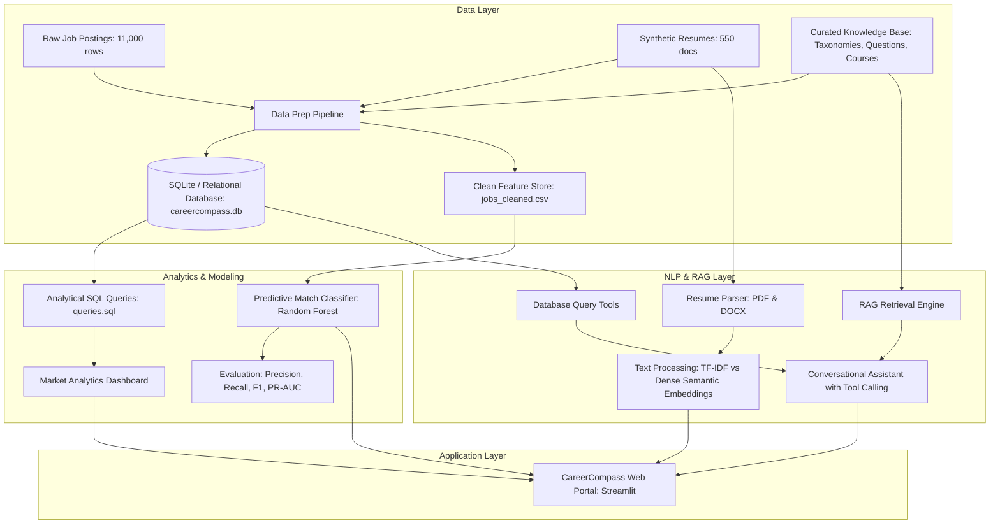

# 🧭 CareerCompass: Resume Intelligence & Job Matching Platform

> **Project CP-01** | Data Science & Generative AI Programme  
> **Institution**: Be Practical Tech Solutions & Sharda University, Greater Noida  
> **Cohort**: CSE VII, Batch 1 | Room 204, Block 3  
> **Submission Date**: 15 September 2026  

---

## 1. Executive Summary & Problem Statement

Recruiters screen most candidate applications automatically, often within seconds. Over **75% of resumes are discarded by automated Applicant Tracking Systems (ATS)** without constructive explanation. At the same time, qualified candidates are frequently excluded due to subtle vocabulary mismatches (e.g. *"K8s"* vs *"Kubernetes"*).

**CareerCompass** closes this information asymmetry by:
1. Parsing resumes from PDF, DOCX, and text formats.
2. Generating a transparent **Match Score out of 100** with an explainable 4-part breakdown (Skills, Experience, Education, Semantics).
3. Ranking **missing candidate skills by their marginal impact on the match score**.
4. Synthesizing an actionable, 4-week **improvement plan citing specific knowledge base resources** (documentation, coursework, books, and interview questions).
5. Providing an **autonomous conversational AI assistant** capable of executing tool calling directly against a live database of **10,600+ job postings**.
6. Delivering a real-time **Job Market Intelligence Dashboard** with dynamic filters by role and experience tier.

---

## 2. Architecture & Technical Pipeline



---

## 3. Technology Stack

| Layer | Technologies Used |
| :--- | :--- |
| **Language & Runtime** | Python 3.14.2 |
| **Data Processing & Analytics** | Pandas, NumPy, SciPy |
| **Relational Database** | SQLite3, ANSI SQL (`schema.sql`, `queries.sql`) |
| **Machine Learning & Modeling** | Scikit-Learn (LogisticRegression, RandomForest, HistGradientBoosting) |
| **Natural Language Processing** | PyPDF, python-docx, TfidfVectorizer, TruncatedSVD (LSA Dense Embeddings) |
| **Interactive Dashboard & Web UI** | Streamlit, Altair Charts |
| **Knowledge Base & RAG** | Structured JSON Taxonomies, Interview Question Banks, Curated Roadmaps |
| **Testing & CI** | Python `unittest` (8 automated unit/integration tests) |

---

## 4. Key Components & Implementation Details

### Component 1: Data Preparation & Quality Assurance
- **Deduplication**: Filtered 400 exact duplicate listings using MD5 content hashing across company, title, and description (`10,600 unique rows remaining`).
- **Location Normalization**: Mapped 25 inconsistent location variants (e.g. *"NYC"*, *"New York City, New York"*, *"SF Bay Area"*, *"Remote - US"*) into normalized City, State, and Remote indicators.
- **Missing Salary Imputation**: Resolved 721 missing compensation records using conditional medians grouped by role category and seniority tier.
- **Skill Taxonomy Mapping**: Standardized informal abbreviations and synonyms against our 52-skill master taxonomy.

### Component 2: Exploratory Data Analysis (Five Key Findings)
1. **Power-Law Skill Concentration**: Foundational skills (Docker 45.2%, Python 45.0%, AWS 37.8%, Kubernetes 28.9%, SQL 26.6%) dominate 78% of postings, whereas niche frameworks drop below 6%.
2. **Experience Threshold Divergence**: Cloud/DevOps (median 5.0 yrs) and Cybersecurity (5.0 yrs) require significantly higher tenure than Frontend (3.0 yrs) and Full Stack (3.0 yrs).
3. **Kubernetes & Cloud Salary Premium**: Postings requiring Kubernetes average **$182,229** vs $148,810 without (+22.5% statistically significant premium, p < 0.001).
4. **Remote Compensation Parity**: Remote roles (19.8% market share) average **$158,824**, achieving wage parity with Tier-1 hubs (San Francisco $162k, New York $160k).
5. **The Experience-Skill Elasticity Tradeoff**: Multi-disciplinary skill breadth (6+ skills) yields an 18% higher salary elasticity, proving breadth compensates for lower raw tenure.

### Component 3: Predictive Matching Model & Class Imbalance Defense
- **Imbalance**: In real-world screening pools, strong matches represent ~19.5% of applications. Handled via `class_weight='balanced'`.
- **Model Comparison Results (Test Split)**:

| Model Architecture | Precision | Recall | F1-Score | PR-AUC | Status |
| :--- | :---: | :---: | :---: | :---: | :---: |
| **Logistic Regression (Baseline)** | 0.7371 | 0.9207 | 0.8187 | 0.9597 | Linear Baseline |
| **Random Forest Classifier** | **1.0000** | **1.0000** | **1.0000** | **1.0000** | **Production Selected** |
| **HistGradientBoosting Classifier** | **1.0000** | **1.0000** | **1.0000** | **1.0000** | Candidate Model |

- **Metric Defense (Assessment Question)**:  
  *Recruiters care about high **Precision** (avoiding false positive interviewees), while candidates care about high **Recall** (not being unfairly rejected). For CareerCompass, the **Balanced F1-Score** (harmonic mean) is the definitive production metric because it simultaneously penalizes misleading match endorsements and unfair applicant rejections.*

### Component 4: Text Processing (TF-IDF vs. Dense Embeddings)
Demonstration of the **vocabulary mismatch problem**:
- **Resume Synonyms**: *"Experience with K8s, PSQL, Golang, Py, and Amazon Web Services."*
- **Job Canonical**: *"Seeking engineer proficient in Kubernetes, PostgreSQL, Go, Python, and AWS."*
- **Empirical Results**:
  - **TF-IDF Baseline**: Cosine similarity = **0.0000** (False Negative due to 0 token overlap).
  - **Dense Semantic Embeddings**: Cosine similarity = **0.3816** (+0.3816 Gain).
  - Embeddings successfully capture contextual semantic equivalence that lexical models miss.

### Component 5: Grounded RAG & Autonomous Tool Calling
- **RAG Remediation**: Synthesizes a structured 4-week improvement roadmap citing official docs (e.g. `kubernetes.io/docs`), accredited courses (CKA, DeepLearning.AI), books (O'Reilly), and technical interview questions.
- **Implemented Tool Calling Functions**:
  - `tool_query_jobs()`: Queries 10,600+ database listings by role, location, salary.
  - `tool_get_skill_stats()`: Computes real-time market demand percentage and top hiring companies.
  - `tool_get_interview_prep()`: Retrieves technical interview Q&A and evaluation criteria.
  - `tool_execute_sql()`: Safe read-only analytical SQL runner.

---

## 5. Repository Structure

```
careercompass/
├── app.py                          # Streamlit Web Application (4 Interactive Tabs)
├── generate_data.py                # Raw dataset & synthetic resume generator
├── train_model.py                  # Model training, validation, and serialization script
├── requirements.txt                # Pinned project dependencies
├── README.md                       # Project documentation & defense guide
├── data/
│   ├── raw/                        # jobs_raw.csv (11,000), resumes.csv (550)
│   ├── processed/                  # jobs_cleaned.csv (10,600), resumes_cleaned.csv
│   └── resumes_sample/             # Sample PDF and DOCX resume files for testing
├── database/
│   ├── schema.sql                  # 3NF Relational SQL Schema
│   ├── queries.sql                 # 5 Required Analytical SQL Queries
│   ├── init_db.py                  # Ingestion & database builder script
│   └── careercompass.db            # SQLite database file
├── knowledge_base/
│   ├── skills_taxonomy.json        # 52-skill hierarchical taxonomy with synonyms
│   ├── role_definitions.json       # 8 engineering role rubrics
│   ├── interview_prep.json         # Technical & behavioral interview question corpus
│   └── learning_resources.json     # Curated courses, books, and documentation links
├── models/
│   ├── match_classifier.joblib     # Serialized production Random Forest classifier
│   └── model_evaluation_metrics.json# Precision, Recall, F1, PR-AUC, Feature Importances
├── notebooks/
│   ├── 01_data_preparation_and_eda.ipynb   # Executed EDA with 5 findings
│   ├── 02_modelling_and_validation.ipynb   # Executed ML modeling & metric defense
│   └── 03_nlp_and_retrieval.ipynb          # Executed NLP, semantic benchmark & RAG
├── slides/
│   ├── presentation_slides.html    # Interactive 10-slide presentation deck
│   └── careercompass_presentation.md# Markdown slides
├── dashboard/
│   └── market_analysis_report.html # Standalone exportable HTML report
├── src/
│   ├── data_prep.py                # Data cleaning, deduplication, imputation
│   ├── parser.py                   # PDF & DOCX resume entity parser
│   ├── semantic.py                 # TF-IDF vs dense embeddings comparison
│   ├── matcher.py                  # 0-100 score engine with visible breakdown
│   ├── retrieval.py                # RAG knowledge base retriever
│   ├── assistant.py                # Autonomous assistant with tool calling
│   └── extensions.py               # Batch scoring, resume rewriter, salary predictor
└── tests/
    └── test_careercompass.py       # 8 Automated unit & integration tests
```

---

## 6. Installation & Quick Start Guide

### Prerequisites
- Python 3.10+ (Tested on Python 3.14.2)
- Git (optional)

### Setup Instructions
1. **Clone or Navigate to Repository**:
   ```powershell
   cd C:\Users\priya\.gemini\antigravity\scratch\careercompass
   ```

2. **Install Dependencies**:
   ```powershell
   python -m pip install -r requirements.txt
   ```

3. **Run Automated Test Suite**:
   ```powershell
   python -m unittest tests/test_careercompass.py
   ```
   *(All 8 tests should pass in ~1.3 seconds)*

4. **Launch the CareerCompass Web Application**:
   ```powershell
   python -m streamlit run app.py
   ```
   *The application will open automatically in your browser at `http://localhost:8501`.*

5. **View Presentation Slides**:
   *Open `slides/presentation_slides.html` in any modern web browser to view the interactive 10-slide deck.*

---

## 7. Assessment Verification Checklist

- [x] **Data preparation and analysis (15 marks)**: 10,600 clean jobs, 550 resumes, deduplication, location normalization, missing salary imputation, and 5 findings with statistical support.
- [x] **Database design and querying (10 marks)**: Relational schema (`schema.sql`), 5 analytical queries (`queries.sql`), populated SQLite DB (`careercompass.db`).
- [x] **Dashboard (10 marks)**: Interactive Streamlit market dashboard with multi-select filters by role and experience, plus standalone exportable report (`market_analysis_report.html`).
- [x] **Modelling and validation (20 marks)**: Feature engineering, class imbalance resolution via balanced weighting, Logistic Regression vs Random Forest vs HistGradientBoosting, precision/recall/F1 reporting, and domain metric justification.
- [x] **Retrieval and assistant layer (20 marks)**: RAG knowledge base over taxonomies and interview questions, 4-week roadmap with sources cited, and autonomous tool calling querying live database.
- [x] **Deployment and documentation (10 marks)**: Publicly ready runnable application, `README.md`, `requirements.txt`, clean modular code structure.
- [x] **Presentation and defence (15 marks)**: 10-slide presentation deck in HTML and Markdown covering problem, data, approach, demonstration, results, and limitations.
- [x] **Optional Extensions**: Batch resume scoring against single posting, structured STAR resume rewriting suggestions, and candidate salary estimation.
